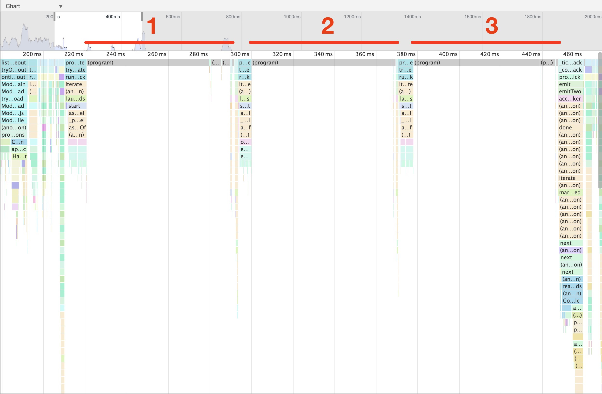
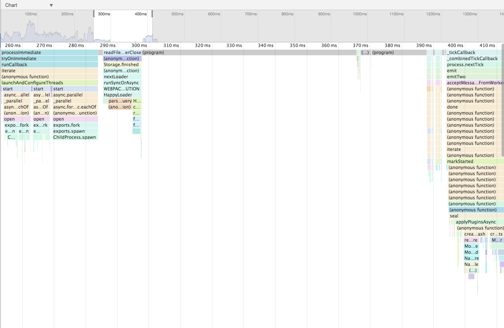

# happypack-perf-test

This repository demonstrates that the startup time of happypack (3.0.1) increases linear with each plugin instance.
In this test, we use three instances of HappyPack and we clearly see how webpack waits for each instance to initialize:



Output:

```
Happy[one]: Version: 3.0.1. Using cache? yes. Threads: 3
Happy[one]: Loaded 1 entries from cache. (0 were stale)
Happy[one]: All set; signalling webpack to proceed.
Happy[two]: Version: 3.0.1. Using cache? yes. Threads: 3
Happy[two]: Loaded 1 entries from cache. (0 were stale)
Happy[two]: All set; signalling webpack to proceed.
Happy[three]: Version: 3.0.1. Using cache? yes. Threads: 3
Happy[three]: Loaded 1 entries from cache. (0 were stale)
Happy[three]: All set; signalling webpack to proceed.
```

This is because webpack waits for every callback of each plugin instance. If we instead use the [`make` hook](http://webpack.github.io/docs/plugins.html#make-parallel) (which is executed in parallel), all plugin instances are initialized in parallel:



Output:

```
Happy[one]: Version: 3.0.1. Using cache? yes. Threads: 3
Happy[two]: Version: 3.0.1. Using cache? yes. Threads: 3
Happy[three]: Version: 3.0.1. Using cache? yes. Threads: 3
Happy[one]: Loaded 1 entries from cache. (0 were stale)
Happy[two]: Loaded 1 entries from cache. (0 were stale)
Happy[three]: Loaded 1 entries from cache. (0 were stale)
Happy[one]: All set; signalling webpack to proceed.
Happy[three]: All set; signalling webpack to proceed.
Happy[two]: All set; signalling webpack to proceed.
```

**Note:** These tests where executed on macOS. It is known that spawning a new process is really slow on macOS and windows compared to linux.

## Setup

If you want to profile this for yourself, run

```
npm i
npm start
```
